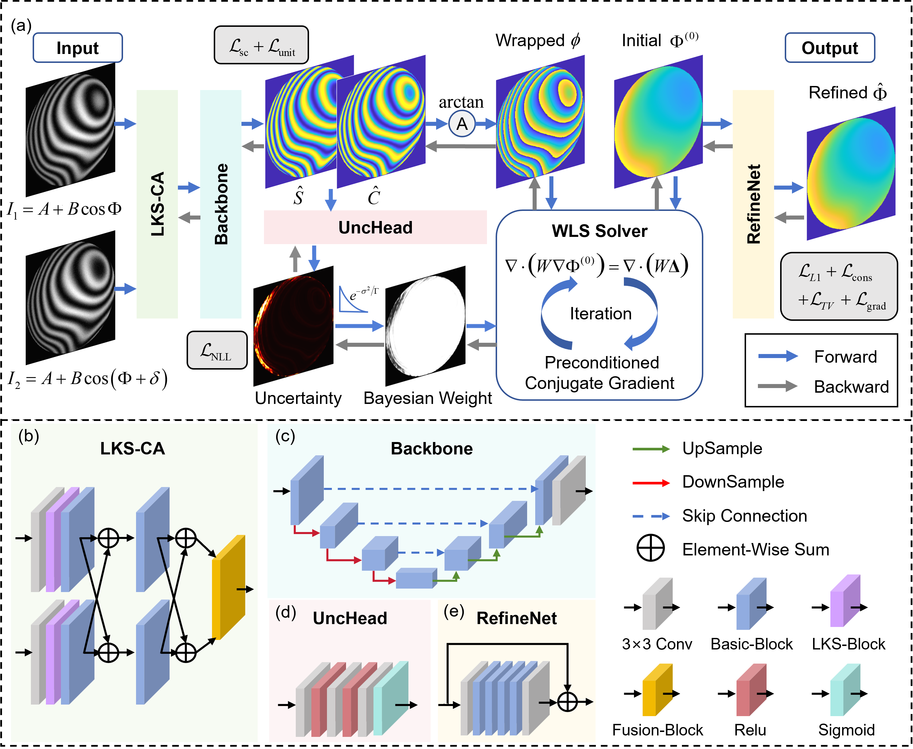

# Physics-Embedded End-to-End Differentiable Framework (PE-E2ED)

Official PyTorch implementation of:

> **Physics-Embedded End-to-End Differentiable Framework for High-Precision and Robust Interferometry**  
> Published in *Laser & Photonics Reviews*.

[](https://doi.org/10.1002/lpor.71606)
[](https://pytorch.org/)
[](LICENSE)

## News

- **2026-07:** The paper was published in *Laser & Photonics Reviews* ([DOI: 10.1002/lpor.71606](https://doi.org/10.1002/lpor.71606)).
- **2026-07:** Training and inference code was released.
- **2026-04:** The paper was submitted.

## Overview

PE-E2ED is a physics-embedded framework for two-frame interferometric phase
retrieval. It integrates a differentiable weighted least-squares phase
unwrapping solver into an end-to-end network, allowing global phase consistency
to participate directly in training. The framework also combines pixel-wise
uncertainty estimation, large-kernel sensing, cross-frame attention, and
physics-informed curriculum learning for accurate and robust phase
reconstruction.

<p align="center">
  
</p>

<p align="center">
  <b>Overview of the proposed PE-E2ED framework.</b>
</p>

## Project structure

```text
PE-E2ED/
├── configs/train.yaml             # Training configuration
├── phase_reconstruction/
│   ├── data.py                    # Dataset
│   ├── layers.py                  # Reparameterization blocks
│   ├── losses.py                  # Loss functions
│   ├── model.py                   # Model definitions
│   └── training.py                # Training utilities
├── pipeline.png                   # Overview of the PE-E2ED framework
├── train.py
└── predict.py                     # Single and batch inference
```

## Installation

Python 3.10 or later is recommended. Install the PyTorch build appropriate for
your CUDA version, then run:

```bash
git clone https://github.com/srzzz76/PE-E2ED.git
cd PE-E2ED
pip install -r requirements.txt
```

## Dataset

Prepare matching 8-bit or 16-bit PNG files using the following structure:

```text
dataset/
├── frame1/
│   └── 0001.png
├── frame2/
│   └── 0001.png
└── phi/
    └── 0001.png
```

Images and phase labels are normalized to `[0, 1]`. In the current
implementation, normalized phase `p` corresponds to physical phase `80p - 40`.

## Training

The default model and training settings are defined in
[`configs/train.yaml`](configs/train.yaml).

By default, PE-E2ED is trained using **two GPUs with Distributed Data Parallel
(DDP)**. The default per-GPU batch size is 4, resulting in a total batch size of
8.

Two GPUs (default):

```bash
torchrun --standalone --nproc-per-node=2 train.py \
  --data-dir "/path/to/dataset" \
  --output-dir "outputs/run-1"
```

Common options include `--epochs`, `--batch-size`, `--learning-rate`,
`--workers`, `--seed`, and `--deterministic`. Training saves `latest.pth`,
`best.pth`, and `metrics.csv` in the output directory.

## Inference

Single image pair:

```bash
python predict.py \
  --frame1 "/path/to/frame1/0001.png" \
  --frame2 "/path/to/frame2/0001.png" \
  --checkpoint "outputs/run-1/best.pth" \
  --output-dir "prediction/0001"
```

Batch prediction and evaluation use the same script:

```bash
python predict.py \
  --data-dir "/path/to/test_dataset" \
  --checkpoint "outputs/run-1/best.pth" \
  --output-dir "results/run-1"
```

Batch inference saves phase images. If labels are available in `phi/`, it also
saves `loss_curve.png`, containing the L1 loss of every test sample. Labels are
optional for inference.

## Reparameterization

During training, the large-kernel block contains a main convolution and
auxiliary dilated branches. The prediction scripts fuse these branches into a
single `13 x 13` depthwise convolution by default. Use
`--no-reparameterize` to disable fusion.

For direct model use:

```python
model.load_state_dict(torch.load("best.pth", map_location="cpu"))
model.eval()
model.switch_to_deploy()
```

## Citation

If this work is useful in your research, please cite:

```bibtex
@article{Shi2026,
  title = {Physics-{{Embedded End}}-{{To}}-{{End Differentiable Framework}} for {{High}}-{{Precision}} and {{Robust Interferometry}}},
  author = {Shi, Runzhou and Yin, Peiyu and Wu, Baokun and Zhang, Tian and Bai, Jian},
  year = {2026},
  month = jul,
  journal = {Laser \& Photonics Reviews},
  pages = {e71606},
  issn = {1863-8880, 1863-8899},
  doi = {10.1002/lpor.71606},
  urldate = {2026-07-22},
  langid = {english}
}
```

## Acknowledgements

Parts of the restoration backbone are derived from
[NAFNet](https://github.com/megvii-research/NAFNet) and BasicSR-style image
restoration code.

## License

This project is released under the [MIT License](LICENSE).
